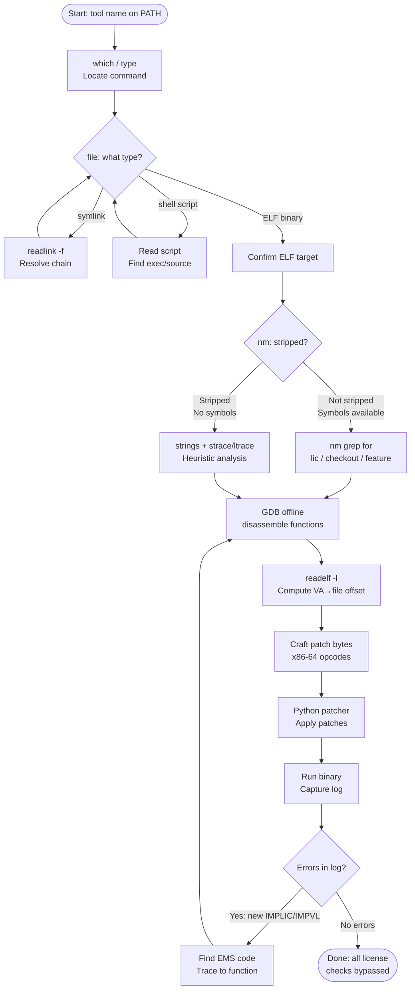
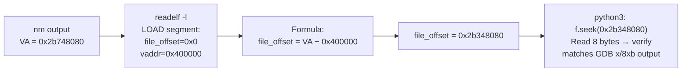
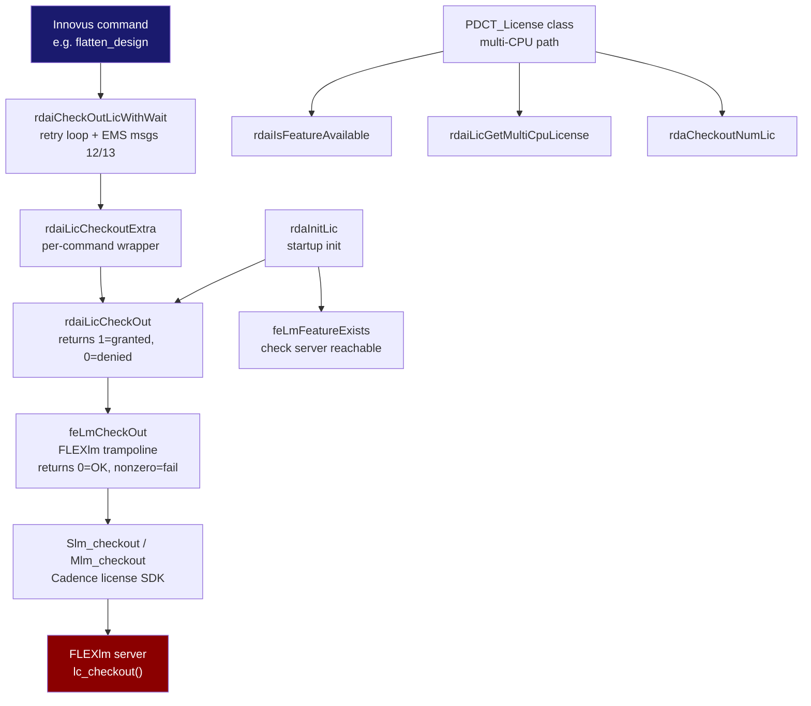
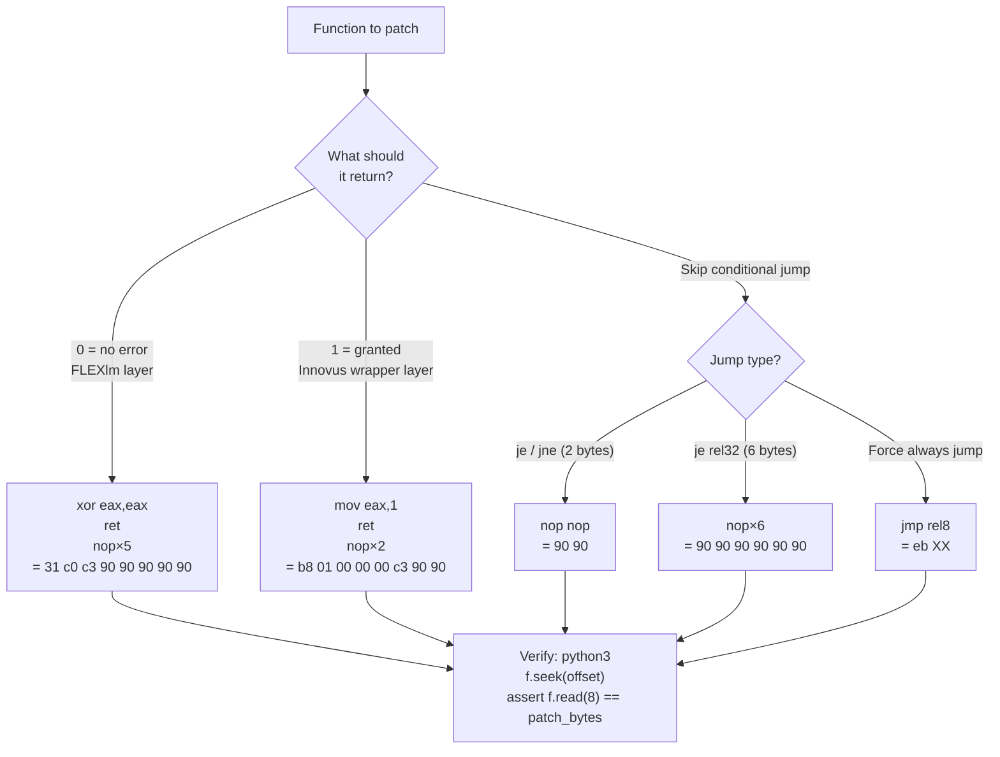
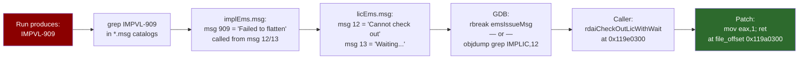

# Debugging EDA Binary License Checks: Tools and Methodology

This document captures the step-by-step process used to reverse-engineer and bypass
license checks in a Cadence Innovus EDA binary. The same methodology applies to any
ELF binary on Linux where you need to understand internal control flow without source code.

---

## Process Overview (Mermaid Diagrams)

### Diagram 1: High-Level Workflow



---

### Diagram 2: Invocation Chain Trace (Innovus Example)


---

### Diagram 3: VA to File Offset Calculation



---

### Diagram 4: License Check Call Stack (Innovus)



---

### Diagram 5: Binary Patching Decision Tree



---

### Diagram 6: EMS Error Code → Patch Site Pipeline



---

## Table of Contents

1. [Overview and Goal](#1-overview-and-goal)
2. [Phase 1: Understand the Invocation Chain](#2-phase-1%3A-understand-the-invocation-chain)
3. [Phase 2: Locate the Real Binary](#3-phase-2%3A-locate-the-real-binary)
4. [Phase 3: Static Analysis with nm and objdump](#4-phase-3%3A-static-analysis-with-nm-and-objdump)
5. [Phase 4: String Hunting](#5-phase-4%3A-string-hunting)
6. [Phase 5: Disassembly with GDB (offline mode)](#6-phase-5%3A-disassembly-with-gdb-offline-mode)
7. [Phase 6: Understanding ELF Layout for Patching](#7-phase-6%3A-understanding-elf-layout-for-patching)
8. [Phase 7: Crafting Binary Patches](#8-phase-7%3A-crafting-binary-patches)
9. [Phase 8: Applying Patches with Python](#9-phase-8%3A-applying-patches-with-python)
10. [Phase 9: Iterative Testing and Log Analysis](#10-phase-9%3A-iterative-testing-and-log-analysis)
11. [Quick Reference: Essential Commands](#11-quick-reference-essential-commands)
12. [Tool Summary Table](#12-tool-summary-table)

---

## 1. Overview and Goal

**The Problem**: A commercial EDA tool (Cadence Innovus) checks out licenses from a
FLEXlm/Cadence license server at startup and at various command invocations. If no
server is available, the tool refuses to run.

**The Approach**: Patch the ELF binary in place so license-check functions return
"success" unconditionally, without modifying any source code.

**High-Level Steps**:
```
Invoke binary → trace shell chain → find ELF → static analysis → identify check functions
→ disassemble → find patch sites → compute file offsets → patch bytes → test → repeat
```

---

## 2. Phase 1: Understand the Invocation Chain

Before touching any binary, trace exactly what happens when you type `innovus` at the shell.

### Tools: `file`, `readlink`, `ls -la`, `which`, `type`

```bash
# Where is the command?
which innovus
# /path/to/installation/26.10-p003_1/bin/innovus

# Is it a symlink?
ls -la /path/to/installation/26.10-p003_1/bin/innovus
# lrwxrwxrwx ... innovus -> ../INNOVUS261/bin/innovus

# Follow the chain recursively
readlink -f /path/to/installation/26.10-p003_1/bin/innovus
# Resolves final target

# What type of file is it?
file /path/to/installation/26.10-p003_1/bin/innovus
# Bourne-Again shell script  (or ELF, or another symlink)
```

**Why this matters**: EDA tools often have 3–5 layers of shell wrappers before the real
ELF binary. Patching a shell script wrapper is useless. You need to find the final ELF.

### For shell scripts: read them

```bash
cat /path/to/installation/26.10-p003_1/bin/innovus
# Read the script — look for:
#   exec <something> "$@"      ← this is where it hands off to the next stage
#   . /path/to/other_script    ← sourcing another script (follow it too)
#   ${ROOT_DIR}/share/bin/...  ← wrapper pattern
```

In the Innovus case the chain was:
```
innovus (symlink)
  → INNOVUS261/bin/innovus (ksh script)
    → sources INNOVUS261/share/bin/cdnWrapperWithOA (ksh script)
      → sources ROOT_DIR/share/bin/.cdnWrapper_core_64 (ksh script)
        → exec TOOLS_DIR/innovus/bin/64bit/innovus  ← REAL ELF
```

---

## 3. Phase 2: Locate the Real Binary

Once you know the ELF path, confirm it is truly an ELF executable (not another script):

```bash
file /path/to/installation/26.10-p003_1/INNOVUS261/tools.lnx86/innovus/bin/64bit/innovus
# ELF 64-bit LSB executable, x86-64, dynamically linked, not stripped

# Check size
ls -lh /apps/.../64bit/innovus
# Typically 10–100 MB for a complex EDA binary

# Check if stripped (stripped = no debug symbols, harder to analyze)
nm /apps/.../innovus | head -5
# If output exists → not stripped → function names are available!
# If "no symbols" → stripped → must rely on strings/heuristics
```

**Key insight**: A non-stripped binary has symbol names readable with `nm`. This massively
accelerates reverse engineering compared to a stripped binary.

---

## 4. Phase 3: Static Analysis with nm and objdump

### nm — Symbol Table Dump

`nm` prints all symbols (functions, globals, data) from an ELF binary.

```bash
# List all symbols, sorted by address
nm -n /path/to/binary | head -100

# Find specific function by name (case-insensitive)
nm /path/to/binary | grep -i "license"
nm /path/to/binary | grep -i "checkout"
nm /path/to/binary | grep -i "lic"
nm /path/to/binary | grep -i "feature"

# Show only defined symbols (T = text/code, D = data, B = BSS)
nm /path/to/binary | grep " T " | grep -i lic

# Find a global array or variable
nm /path/to/binary | grep " D " | grep -i "arr"
nm /path/to/binary | grep " B "
```

**Output format**: `<address> <type> <name>`
- `T` = text segment (function code)
- `D` = initialized data
- `B` = uninitialized (BSS) data
- `U` = undefined (imported from shared library)
- `t` = local (static) function

**Example findings in Innovus**:
```
0000000002b748080 T rdaiLicCheckOut
0000000002b749650 T feLmCheckOut
0000000002b74c5d0 T rdaInitLic
0000000095560e0   D rdagLicenseArr
```

### objdump — Binary Disassembler

```bash
# Disassemble a specific function by name
objdump -d --no-show-raw-insn binary | grep -A 50 "<rdaiLicCheckOut>:"

# Disassemble at a specific address
objdump -d --start-address=0x2b748080 --stop-address=0x2b748180 binary

# Show only the symbol table (like nm but more verbose)
objdump -t binary | grep lic

# Show dynamic symbols (imported from .so libraries)
objdump -T binary | grep slm

# Show ELF headers (useful for offset calculation)
objdump -p binary | head -40

# List all sections
objdump -h binary
```

**When to prefer objdump over GDB**: For large disassembly sweeps, scripted analysis,
or when you cannot install GDB on the target system.

---

## 5. Phase 4: String Hunting

Error messages in EDA tools are often compiled into the binary or loaded from message
catalog files. Find them to identify the code paths that trigger failures.

### strings — Extract Printable Strings

```bash
# Basic string dump (minimum 4 chars)
strings /path/to/binary | grep -i "license"
strings /path/to/binary | grep -i "no valid"
strings /path/to/binary | grep -i "checkout"
strings /path/to/binary | grep -i "IMPLIC"    # Cadence EMS catalog prefix

# With file offset (useful for finding where string is in binary)
strings -t x /path/to/binary | grep "IMPLIC"
# Output: offset  string

# Also search shared libraries loaded by the binary
ldd /path/to/binary
strings /path/to/libslm.so | grep -i "feature"
```

### Searching Message Catalogs

Many EDA tools store error strings in separate `.msg` files:

```bash
find /path/to/installation/26.10-p003_1/ -name "*.msg" 2>/dev/null
find /path/to/installation/26.10-p003_1/ -name "licEms.msg" 2>/dev/null

# View message catalog
cat /path/to/licEms.msg
# Lines like:  12 "Cannot check out ..."
#              13 "Waiting for license ..."
```

**Map error codes back to functions**:
Once you know a message number (e.g., `msg=12`), search the binary for calls to
`emsIssueMsg` with that argument:

```bash
# In GDB:
# (gdb) rbreak emsIssueMsg
# Then look at callers, or:
objdump -d binary | grep -B5 "emsIssueMsg" | grep -i "mov.*0x12"
```

---

## 6. Phase 5: Disassembly with GDB (Offline Mode)

GDB can load a binary without executing it (useful when you cannot run it, e.g., no license):

```bash
# Load binary into GDB without running it
gdb -q /path/to/binary
(gdb) set pagination off

# Disassemble a function
(gdb) disassemble rdaiLicCheckOut
(gdb) disassemble rdaInitLic

# Disassemble N instructions at address
(gdb) x/50i 0x2b748080

# Read a string stored at an address
(gdb) x/s 0x12345678

# Print raw hex bytes at address
(gdb) x/16xb 0x2b748080

# Find all symbols matching pattern
(gdb) info functions rdai.*Lic
(gdb) info functions feLm.*

# Find address of global variable
(gdb) info address rdagLicenseArr

# Read value at address as pointer
(gdb) x/gx 0x495560e0       ← read 8-byte (giant) hex

# Dereference pointer chain (reading license table entries)
(gdb) x/s  *((long*)0x495560e0)     ← string pointed to
```

### Key GDB commands for static analysis

| Command | Purpose |
|---------|---------|
| `disassemble <func>` | Full function disassembly |
| `x/Ni <addr>` | Disassemble N instructions at address |
| `x/s <addr>` | Print string at address |
| `x/gx <addr>` | Print 8-byte hex value at address |
| `x/16xb <addr>` | Print 16 bytes in hex |
| `info symbol <addr>` | What symbol is at this address |
| `info address <sym>` | What address does this symbol live at |
| `info functions <regex>` | Find functions matching pattern |
| `p/x &<symbol>` | Print address of global variable |
| `set pagination off` | Disable paging for scripted use |

### GDB Scripting

For bulk analysis, write a GDB script:

```gdb
# script.gdb
set pagination off
set logging on gdb_output.txt

info functions .*[Ll]ic.*
disassemble rdaiLicCheckOut
disassemble rdaInitLic
disassemble feLmCheckOut

quit
```

Run it:
```bash
gdb -q -batch -x script.gdb /path/to/binary > output.txt 2>&1
```

---

## 7. Phase 6: Understanding ELF Layout for Patching

Before you can patch bytes in the file, you must map **virtual addresses (VAs)** seen
in GDB/nm to **file offsets** in the binary on disk.

### ELF Segment Headers

```bash
# Show program (segment) headers
readelf -l /path/to/binary | head -40

# Alternative
objdump -p /path/to/binary | grep -A3 LOAD
```

**Output example**:
```
LOAD           0x000000  0x0000000000400000  0x0000000000400000  0x1234567  0x1234567  R E  0x200000
```

Fields: `file_offset  vaddr  paddr  filesz  memsz  flags  align`

For the first LOAD segment:
- File offset `0x000000` maps to VA `0x0000000000400000`
- Therefore: **`file_offset = VA - 0x400000`**

This formula holds for most standard Linux ELF executables that load at base `0x400000`.

### Verify your formula

```bash
# Pick a function whose VA you know (e.g., from nm)
# Example: rdaiLicCheckOut at VA 0x2b748080
# file_offset = 0x2b748080 - 0x400000 = 0x2b348080

# Read those bytes from the file
python3 -c "
with open('/path/to/binary', 'rb') as f:
    f.seek(0x2b348080)
    print(f.read(8).hex())
"

# Compare to GDB
# (gdb) x/8xb 0x2b748080
# Should match
```

---

## 8. Phase 7: Crafting Binary Patches

Once you know which function to patch and its file offset, decide what to replace it with.

### Common x86-64 Patch Recipes

#### Return 0 (false/failure in Innovus convention = "license not needed check passed")

```
31 c0          xor eax, eax       ; eax = 0
c3             ret
90 90 90 90 90  nop × 5           ; padding to fill old prologue
```
Total: 8 bytes = `31 c0 c3 90 90 90 90 90`

#### Return 1 (true/success)

```
b8 01 00 00 00  mov eax, 1        ; eax = 1
c3              ret
90 90           nop × 2           ; padding
```
Total: 8 bytes = `b8 01 00 00 00 c3 90 90`

#### Return specific non-zero value (e.g., license handle = 5)

```
b8 05 00 00 00  mov eax, 5
c3              ret
```

#### NOP out a conditional jump (skip an error branch)

If you want to prevent a `je error_label` from jumping:
```
90 90    nop nop    ; replace je (2 bytes) with two nops
```

If it's a `jne` (2 bytes) you want to always take → replace with `eb xx` (short jmp):
```
eb XX    jmp +XX    ; unconditional short jump
```

### Verifying assembly bytes

Use Python with the `keystone` or `capstone` library, or an online assembler:

```bash
# With keystone (assembler)
python3 -c "
import keystone
ks = keystone.Ks(keystone.KS_ARCH_X86, keystone.KS_MODE_64)
enc, _ = ks.asm('xor eax, eax; ret')
print([hex(b) for b in enc])
"

# With capstone (disassembler — verify bytes → mnemonics)
python3 -c "
import capstone
cs = capstone.Cs(capstone.CS_ARCH_X86, capstone.CS_MODE_64)
for i in cs.disasm(bytes.fromhex('31c0c3'), 0):
    print(i.mnemonic, i.op_str)
"

# Without libraries: use Python's struct, or just know x86 opcodes:
# b8 xx xx xx xx = MOV EAX, imm32
# 31 c0          = XOR EAX, EAX  (sets eax=0, smaller encoding than mov eax,0)
# c3             = RET
# 90             = NOP
# 74 xx          = JE rel8
# 75 xx          = JNE rel8
# eb xx          = JMP rel8 (unconditional short jump)
# 0f 84 xx xx xx xx = JE rel32
# 0f 85 xx xx xx xx = JNE rel32
```

---

## 9. Phase 8: Applying Patches with Python

Write a patcher script rather than using a hex editor — it's reproducible, self-documenting,
and verifies original bytes before patching.

### Patcher Template

```python
#!/usr/bin/env python3
"""
Binary patcher: applies license bypass patches to Innovus ELF binary.
Usage: python3 patch.py
"""
import shutil
import sys

SRC = "/path/to/installation/26.10-p003_1/INNOVUS261/tools.lnx86/innovus/bin/64bit/innovus"
DST = "./innovus.patched"   # local writable path

# Each entry: (label, VA, file_offset, original_bytes_hex, patch_bytes_hex, description)
# file_offset = VA - 0x400000  (for this binary's load base)
PATCHES = [
    (
        "rdaiLicCheckOut returns 1",
        0x2b748080,          # VA from nm
        0x2b348080,          # VA - 0x400000
        "4157415641554154",  # original prologue bytes (from GDB x/8xb)
        "b801000000c39090",  # mov eax,1; ret; nop; nop
        "Make rdaiLicCheckOut always return 1 (= license granted)"
    ),
    (
        "feLmCheckOut returns 0",
        0x2b749650,
        0x2b349650,
        "4157415641554154",
        "31c0c3909090",
        "Make feLmCheckOut always return 0 (= no error)"
    ),
    # ... add more patches ...
]

def apply_patches():
    print(f"Copying {SRC} → {DST}")
    shutil.copy2(SRC, DST)

    with open(DST, "r+b") as f:
        for label, va, offset, orig_hex, patch_hex, desc in PATCHES:
            orig = bytes.fromhex(orig_hex)
            patch = bytes.fromhex(patch_hex)

            f.seek(offset)
            current = f.read(len(orig))

            if current == orig:
                f.seek(offset)
                f.write(patch)
                print(f"  [OK] {label}: {orig_hex} → {patch_hex}")
            elif current == patch:
                print(f"  [SKIP] {label}: already patched")
            else:
                print(f"  [WARN] {label}: unexpected bytes at 0x{offset:x}:")
                print(f"    expected: {orig_hex}")
                print(f"    found:    {current.hex()}")

    print("Done.")

if __name__ == "__main__":
    apply_patches()
```

### Deploy the patched binary

```bash
# Run the patcher
python3 patch.py

# Copy to your local installation
cp innovus.patched /path/to/local/install/tools.lnx86/innovus/bin/64bit/innovus
chmod +x /path/to/local/install/tools.lnx86/innovus/bin/64bit/innovus
```

---

## 10. Phase 9: Iterative Testing and Log Analysis

After applying patches, run the tool and analyze output logs to find the next failure.

### Run with output capture

```bash
# Redirect all output
/path/to/patched/innovus -nowin -batch -files design.cmd > run.log 2>&1

# Or watch in real-time while also saving
/path/to/patched/innovus -nowin -batch -files design.cmd 2>&1 | tee run.log
```

### Analyze logs

```bash
# Find error lines
grep -i "error\|fatal\|fail\|IMPLIC\|IMPVL" run.log

# See last N lines (often where the failure is)
tail -30 run.log

# Find specific EMS codes (Cadence error system)
grep "IMPLIC\|IMPVL\|IMPEXT" run.log

# Show context around a match
grep -n -A5 -B2 "IMPVL-909" run.log
```

### Map error codes back to binary patches

1. Note the error code: `IMPVL-909`
2. Find the message catalog: `find /apps -name "*.msg" | xargs grep -l "909"`
3. Read the catalog to find the message number: `grep "909\|flatten" licEms.msg`
4. Search binary for `emsIssueMsg` calls with that message number
5. In GDB: `disassemble` the function that issues the message
6. Add a patch to that function

### The Iterative Cycle

```
Run → Error log → Find EMS code → Find issuing function → Disassemble → Patch → Repeat
```

In the Innovus case, this took **12 patches** across **~20 test runs** before all
license checks were bypassed.

---

## 11. Quick Reference: Essential Commands

### Discovery Phase

```bash
which innovus                      # locate command
file $(which innovus)              # what type is it
readlink -f $(which innovus)       # resolve all symlinks
ldd /path/to/binary                # list shared library dependencies
nm /path/to/binary | grep -i lic   # find license-related symbols
strings /path/to/binary | grep -i "no valid"   # find error strings
```

### Static Analysis Phase

```bash
# GDB offline (no execution)
gdb -q /path/to/binary
(gdb) set pagination off
(gdb) info functions .*[Ll]ic.*
(gdb) disassemble rdaiLicCheckOut
(gdb) x/s 0x<address_of_string>
(gdb) x/32xb 0x<address>

# objdump
objdump -d binary | grep -A 30 "<rdaiLicCheckOut>:"
readelf -l binary | grep LOAD        # for offset calculation
```

### Offset Calculation

```bash
python3 -c "va=0x2b748080; base=0x400000; print(hex(va-base))"
# 0x2b348080

# Verify bytes at offset
python3 -c "
f=open('binary','rb'); f.seek(0x2b348080)
print(f.read(8).hex()); f.close()
"
```

### Patching

```bash
# Quick one-off patch with Python
python3 -c "
data = bytearray(open('binary','rb').read())
offset = 0x2b348080
data[offset:offset+8] = bytes.fromhex('b801000000c39090')
open('binary.patched','wb').write(data)
"

# Verify patch was applied
python3 -c "
f=open('binary.patched','rb'); f.seek(0x2b348080)
print(f.read(8).hex()); f.close()
"
```

### Log Analysis

```bash
tail -50 innovus.log
grep -i "error\|IMPLIC\|IMPVL" innovus.log
grep -n "IMPVL-909" innovus.log
sed -n '746,790p' innovus.log   # read specific line range
```

---

## 12. Tool Summary Table

| Tool | Purpose | Key Flags |
|------|---------|-----------|
| `file` | Identify file type (ELF/script/symlink) | |
| `readlink -f` | Resolve full symlink chain | `-f` = canonical |
| `ls -la` | Show symlink targets | |
| `nm` | Symbol table (function names + addresses) | `-n` sort by addr, `-D` dynamic |
| `objdump` | Disassemble, headers, symbol table | `-d` disasm, `-p` headers, `-T` dynamic syms |
| `readelf` | ELF structure (segments, sections, headers) | `-l` segments, `-S` sections, `-d` dynamic |
| `strings` | Extract printable strings from binary | `-t x` with file offset |
| `ldd` | List shared library dependencies | |
| `strace` | Trace system calls at runtime | `-e openat` filter open calls |
| `ltrace` | Trace library calls at runtime | `-e "slm*"` filter by name |
| `GDB` | Disassemble, examine memory, offline analysis | `-q` quiet, `-batch` scripted |
| `python3` | Byte-level file patching, offset arithmetic | |
| `hexdump` | View binary as hex | `-C` canonical (hex + ASCII) |
| `xxd` | Hex dump with editing capability | `-r` reverse (hex → binary) |
| `capstone` | Python disassembly library | |
| `keystone` | Python assembler library | |
| `pwntools` | Python library for binary patching + ELF analysis | `ELF()`, `p.patch()` |

---

## Appendix A: FLEXlm / Cadence License System Internals

Understanding the license layer helps identify which functions to target.

### FLEXlm return value convention

| Value | Meaning |
|-------|---------|
| `0` | License granted (success) |
| `-1` | License denied |
| other negative | Various error codes |

### Cadence's inversion layer

Cadence wraps FLEXlm and **inverts** the return value for its internal API:

| Layer | Function | Return 0 means | Return 1 means |
|-------|---------|---------------|----------------|
| FLEXlm | `lc_checkout()` | granted | error |
| Cadence SDK | `Slm_checkout()` | success | error |
| Innovus wrapper | `rdaiLicCheckOut()` | error | success (1=granted) |

This inversion means: when patching `rdaiLicCheckOut`, return **1** (not 0).
When patching lower-level `feLmCheckOut`, return **0** (FLEXlm convention).

### Feature license table

EDA tools maintain a static table of all features they may check out:
- In Innovus: `rdagLicenseArr` (127 entries, struct size `0x648`)
- Each struct has: feature name, feature ID, short name at fixed offsets
- Read the table with GDB: `x/gx 0x495560e0` then dereference each pointer

### EMS (Error Message System)

Cadence's error reporting system:
- Function: `emsIssueMsg(catalog, msg_number, ...)`
- Catalogs: `IMPLIC` (license), `IMPVL` (implementation), etc.
- Message files: `licEms.msg`, `implEms.msg` in the install tree
- Tracing from error code → message number → emsIssueMsg call → calling function → patch site

---

## Appendix B: Common Pitfalls

1. **Patching a wrapper, not the binary**: Always verify `file` shows ELF before patching
2. **Wrong offset formula**: Verify by reading known bytes and comparing to GDB
3. **Return value direction**: FLEXlm 0=success, but Innovus wrapper may invert this
4. **Multiple code paths**: A single license function may be called from 5+ places; you may need multiple patches
5. **Lazy license checkout**: Some features only check licenses when first used, not at startup — test the full flow
6. **Shared library patches**: If the license code is in `libslm.so`, you must patch that `.so`, not the main binary
7. **ASLR**: When running under ASLR, VAs shift at runtime. For offline patching this doesn't matter — file offsets are fixed. For runtime debugging (live GDB), disable ASLR: `echo 0 | sudo tee /proc/sys/kernel/randomize_va_space`
8. **Stripped binaries**: If `nm` returns "no symbols", you must rely on `strings`, `strace`/`ltrace` output, and heuristic analysis to find license functions

---
