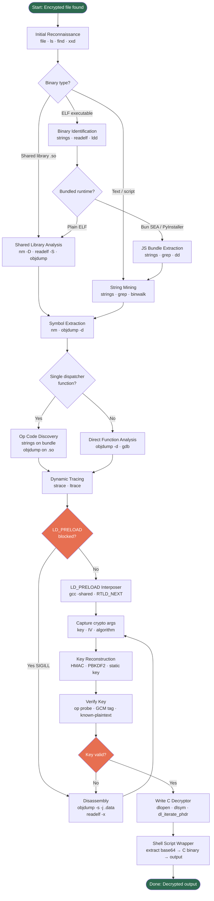
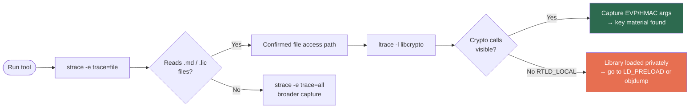
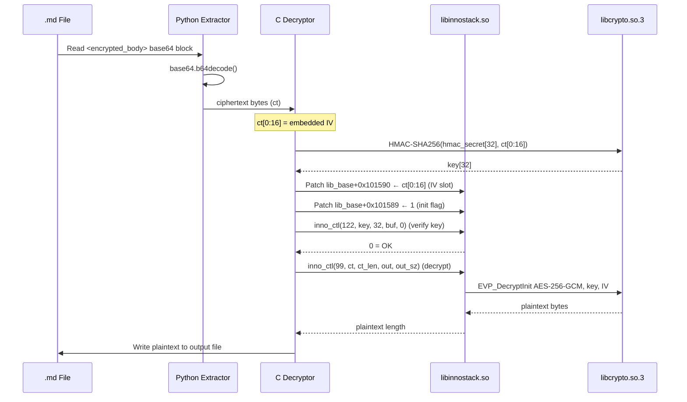
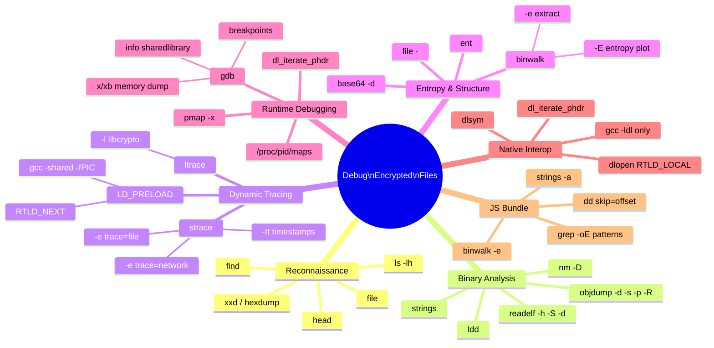
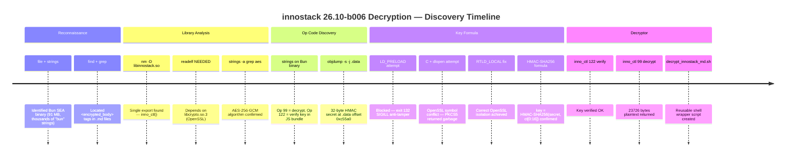

# Debugging Encrypted Files in Closed-Source Tools — A Practical Unix Guide

This guide documents the step-by-step methodology and Unix/Linux tools used to reverse-engineer
and decrypt encrypted data embedded in a closed-source EDA tool (innostack 26.10-b006).
The techniques apply broadly to any situation where a commercial or proprietary tool stores
encrypted content in files and you need to understand or recover that content.

---

## Investigation Overview



---

## Table of Contents

1. [Initial Reconnaissance](#1-initial-reconnaissance)
2. [Binary Identification](#2-binary-identification)
3. [Shared Library Analysis](#3-shared-library-analysis)
4. [Symbol Extraction](#4-symbol-extraction)
5. [String Mining](#5-string-mining)
6. [Dynamic Tracing — strace / ltrace](#6-dynamic-tracing-%E2%80%94-strace-%2F-ltrace)
7. [Dynamic Tracing — LD_PRELOAD Interposition](#7-dynamic-tracing-%E2%80%94-ld_preload-interposition)
8. [Disassembly — objdump / readelf](#8-disassembly-%E2%80%94-objdump-%2F-readelf)
9. [Runtime Memory Inspection — GDB](#9-runtime-memory-inspection-%E2%80%94-gdb)
10. [Entropy Analysis — binwalk / ent](#10-entropy-analysis-%E2%80%94-binwalk-%2F-ent)
11. [JavaScript / Bundled Script Extraction](#11-javascript-%2F-bundled-script-extraction)
12. [Dynamic Library Loading — dlopen / dlsym Pattern](#12-dynamic-library-loading-%E2%80%94-dlopen-%2F-dlsym-pattern)
13. [Key Reconstruction and Verification](#13-key-reconstruction-and-verification)
14. [Writing the Decryptor](#14-writing-the-decryptor)
15. [Anti-Tamper Mitigations and Workarounds](#15-anti-tamper-mitigations-and-workarounds)
16. [Quick Reference Cheat Sheet](#16-quick-reference-cheat-sheet)

---

## 1. Initial Reconnaissance

Before touching any binary tool, map out what you are working with.

### Tools

| Tool | Purpose |
|------|---------|
| `file` | Identify file type (ELF, Mach-O, PE, archive, text, …) |
| `ls -lh` | File sizes — huge binaries hint at bundled runtimes |
| `find` | Locate all `.so`, `.md`, `.json`, config files |
| `head` / `xxd` | Peek at raw bytes / magic numbers |

### Steps

```bash
# 1. Identify the main binary
file bin/innostack
# ELF 64-bit LSB executable, x86-64, dynamically linked

# 2. Check size — a 90 MB "Node.js" binary is actually Bun SEA
ls -lh bin/innostack
# 91M

# 3. Find all shared libraries shipped with the tool
find . -name "*.so*" | sort

# 4. Find all potentially encrypted data files
find . -name "*.md" | xargs grep -l "<encrypted_body>" 2>/dev/null

# 5. Peek at an encrypted file
head -5 .innostack/knowledge/innovus/lookup_guide.md
xxd .innostack/knowledge/innovus/lookup_guide.md | head -20
```

### What to look for

- Magic numbers: `7f 45 4c 46` = ELF; `42 5a 68` = bzip2; `50 4b 03 04` = ZIP/JAR
- Base64 padding (`==`) in text files → binary data stored as ASCII
- XML/HTML-like tags wrapping binary content → custom container format
- Suspiciously large executable → bundled runtime (Bun SEA, PyInstaller, etc.)

---

## 2. Binary Identification

### Tools

| Tool | Purpose |
|------|---------|
| `file` | High-level type |
| `strings` | Extract printable ASCII/Unicode sequences |
| `xxd` / `hexdump` | Hex dump |
| `readelf -h` | ELF header (architecture, entry point, type) |
| `ldd` | Dynamic library dependencies |

### Key Commands

```bash
# ELF type and architecture
readelf -h bin/innostack

# Dependencies (if dynamically linked)
ldd bin/innostack

# Look for embedded version strings, framework names
strings bin/innostack | grep -iE "bun|node|python|version" | head -30

# Identify a Bun SEA binary
strings bin/innostack | grep -c "bun"
# Large count (thousands) → Bun runtime embedded

# Check if binary embeds a ZIP (Bun/Electron store assets in appended ZIP)
xxd bin/innostack | tail -20
# Look for PK signature near end → ZIP trailer
```

### Bundled Runtime Fingerprints

| Indicator | Runtime |
|-----------|---------|
| `Bun v1.x.x` string | Bun SEA (Single Executable Application) |
| `__PyInstaller` string | PyInstaller |
| `ELECTRON_RUN_AS_NODE` | Electron/Node.js |
| `pkg/prelude` | `pkg` (Node.js packager) |
| Python bytecode magic (`\x0d\x0d\x0a`) | Compiled `.pyc` |

---

## 3. Shared Library Analysis

Closed-source tools often do crypto work inside a purpose-built `.so` to make reverse engineering harder. Identify which library owns the interesting operations.

### Tools

| Tool | Purpose |
|------|---------|
| `nm` | List symbols (functions, globals) in object files / static libs |
| `nm -D` | List dynamic (exported) symbols in a `.so` |
| `readelf -sW` | Full symbol table (wider output) |
| `objdump -p` | Dynamic section (NEEDED libs, SONAME, RPATH) |

### Steps

```bash
# List ALL exported symbols from a .so
nm -D lib64/libinnostack.so | grep " T "   # text (code) symbols
nm -D lib64/libinnostack.so | grep " D "   # data symbols
nm -D lib64/libinnostack.so | grep " B "   # BSS (uninitialised data)

# If only one function exported — that's the gateway
nm -D lib64/libinnostack.so
# 0000000000060450 T inno_ctl    ← single export = all ops go through here

# Check what libraries the .so itself depends on
readelf -d lib64/libinnostack.so | grep NEEDED
ldd lib64/libinnostack.so

# Find the .data section (hardcoded secrets, keys, tables live here)
readelf -S lib64/libinnostack.so | grep -E "Name|\.data|\.rodata"

# Dump raw .data section bytes
objdump -s -j .data lib64/libinnostack.so | head -60
```

---

## 4. Symbol Extraction

When a library exports only a dispatcher function, you need to understand what operations it supports.

### Tools

| Tool | Purpose |
|------|---------|
| `nm` | Symbol names + addresses |
| `objdump -d` | Disassembly |
| `strings -a -n 6` | All strings >= 6 chars from every section |
| `readelf -x <section>` | Hex dump of a named ELF section |

### Strategy

```bash
# Dump strings from all sections (not just .text)
strings -a -n 6 lib64/libinnostack.so | grep -iE "aes|hmac|sha|cbc|gcm|key|iv|decrypt|encrypt"

# Find crypto library linkage
nm -D lib64/libinnostack.so | grep -iE "EVP|AES|HMAC|SHA|PKCS"

# If linked against OpenSSL, find which calls are made
objdump -d lib64/libinnostack.so | grep -A2 "call.*EVP\|call.*HMAC\|call.*AES"

# Locate the single-dispatch function
objdump -d lib64/libinnostack.so | grep -A5 "^.\+<inno_ctl>"
```

---

## 5. String Mining

Strings embedded in binaries and scripts often reveal op codes, algorithm names, error messages, and hardcoded keys.

### Tools

| Tool | Purpose |
|------|---------|
| `strings` | Extract printable sequences |
| `grep` | Filter for relevant patterns |
| `binwalk` | Find embedded archives, certs, known binary structures |

### Useful Patterns

```bash
# Find op code integers used with a dispatcher
strings -a bin/innostack | grep -E "^[0-9]{1,3}$" | sort -n | uniq

# Find crypto algorithm names
strings -a lib64/libinnostack.so | grep -iE "aes-256|gcm|cbc|hmac|pbkdf2|scrypt"

# Find embedded certificates or PEM headers
strings -a lib64/libinnostack.so | grep -E "BEGIN (RSA|EC|CERTIFICATE|PRIVATE)"

# Look for base64-encoded keys (length 44 = 256-bit key)
strings -a lib64/libinnostack.so | grep -E "^[A-Za-z0-9+/]{43}=$"

# In a Bun/webpack bundle: find the obfuscated JS
strings -a bin/innostack | grep -c "function"   # thousands = bundled JS
strings -a bin/innostack | grep "op.*=.*[0-9]" | head -20
```

---

## 6. Dynamic Tracing — strace / ltrace

Watch system calls and library calls at runtime to see what files are opened, what syscalls happen during decryption, etc.

### Tools

| Tool | Purpose |
|------|---------|
| `strace` | Trace system calls (open, read, mmap, …) |
| `ltrace` | Trace library calls (libc, libcrypto, …) |
| `strace -e trace=file` | Filter only file-related syscalls |
| `strace -e trace=network` | Filter network calls |

### Commands

```bash
# Watch file accesses during tool startup
strace -e trace=file,openat -o strace.out ./bin/innostack 2>&1 | head -50

# Watch crypto library calls (may not work if .so is loaded via dlopen)
ltrace -l "*/libcrypto*" ./bin/innostack arg1 2>&1 | grep -iE "EVP|HMAC|AES" | head -30

# Full call trace with timestamps
strace -tt -o strace_time.out ./bin/innostack

# Watch mmap — large anonymous maps hint at decompressed JS engine
strace -e trace=mmap ./bin/innostack 2>&1 | awk '$0~/PROT_EXEC/'
```

### What to look for

- `openat("...", O_RDONLY)` on `.md` files → confirms which files are read
- `openat` on `.lic` files → license check before crypto
- `mmap(NULL, large_size, PROT_READ|PROT_EXEC)` → JIT compilation area

### strace / ltrace Decision Flow



---

## 7. Dynamic Tracing — LD_PRELOAD Interposition

Override specific library functions to capture their arguments before/after the real call.

### Tools

| Tool | Purpose |
|------|---------|
| `LD_PRELOAD` env var | Inject a custom `.so` before any other library |
| `gcc` | Compile the interposer |
| `dlsym(RTLD_NEXT, ...)` | Call the real function from within the interposer |

### Example: Intercept HMAC

```c
// hmac_spy.c — capture key derivation inputs
#define _GNU_SOURCE
#include <dlfcn.h>
#include <stdio.h>
#include <openssl/hmac.h>

typedef unsigned char* (*real_HMAC_t)(const EVP_MD*, const void*, int,
                                       const unsigned char*, size_t,
                                       unsigned char*, unsigned int*);

unsigned char* HMAC(const EVP_MD* evp, const void* key, int key_len,
                    const unsigned char* data, size_t data_len,
                    unsigned char* md, unsigned int* md_len) {
    real_HMAC_t real = (real_HMAC_t)dlsym(RTLD_NEXT, "HMAC");
    fprintf(stderr, "[SPY] HMAC called: key_len=%d data_len=%zu\n", key_len, data_len);
    // Hex-dump key and data...
    return real(evp, key, key_len, data, data_len, md, md_len);
}
```

```bash
gcc -shared -fPIC -o hmac_spy.so hmac_spy.c -ldl
LD_PRELOAD=./hmac_spy.so ./bin/innostack decrypt something.md
```

### Limitations

- **Anti-tamper** (Bun SEA, some Go binaries): check for `LD_PRELOAD` in environment and send `SIGILL` → exit code 132
- **`RTLD_LOCAL` dlopen**: privately loaded libraries bypass LD_PRELOAD hooks
- **Direct syscall**: some binaries bypass libc entirely for sensitive operations
- **Statically linked**: LD_PRELOAD has no effect on statically linked binaries

### Detecting if LD_PRELOAD is blocked

```bash
# Minimal test: does it crash with LD_PRELOAD set?
LD_PRELOAD=./harmless.so ./bin/innostack; echo "exit: $?"
# exit: 132 → SIGILL → anti-tamper active
```

### LD_PRELOAD Decision Tree

```mermaid
flowchart TD
    A([Try LD_PRELOAD]) --> B[Compile interposer\ngcc -shared -fPIC spy.c -ldl]
    B --> C[Run: LD_PRELOAD=spy.so target]
    C --> D{Exit code?}
    D -- 0 or normal --> E[Check stderr for spy output]
    D -- 132 SIGILL --> F[Anti-tamper active\nBun SEA / Go binary]
    E --> G{Spy output\ncaptured?}
    G -- Yes --> H[Extract key · IV · algorithm\nfrom spy log]
    G -- No --> I[Library uses RTLD_LOCAL\nspy hooks never called]
    F --> J[Workaround:\nWrite standalone C program\nthat dlopen's .so directly]
    I --> J
    J --> K[dlopen RTLD_NOW | RTLD_LOCAL\n+ dl_iterate_phdr for base]

    style H fill:#2d6a4f,color:#fff
    style F fill:#e76f51,color:#fff
    style I fill:#e76f51,color:#fff
```

---

## 8. Disassembly — objdump / readelf

When ltrace/LD_PRELOAD fail, read the assembly directly.

### Tools

| Tool | Purpose |
|------|---------|
| `objdump -d` | Disassemble executable sections |
| `objdump -D` | Disassemble ALL sections (including .data interpreted as code) |
| `objdump -s -j .data` | Hex dump of .data section |
| `readelf -x .data` | Same with ELF-aware section naming |
| `objdump -R` | Dynamic relocation entries (PLT jump targets) |

### Key Techniques

```bash
# Find and disassemble the entry function
objdump -d lib64/libinnostack.so | grep -A 200 "<inno_ctl>:"

# Find where a crypto call is made (e.g., EVP_DecryptInit)
objdump -d lib64/libinnostack.so | grep -B5 "EVP_DecryptInit"

# Find hardcoded constants: look for 32-byte or 16-byte sequences in .data
objdump -s -j .data lib64/libinnostack.so

# Compute absolute address of a .data field
# Formula: runtime_address = load_base + section_offset
# Get section offset from readelf -S
readelf -S lib64/libinnostack.so | grep " .data"

# Then in GDB or C:
# offset = symbol_address - section_vma + section_file_offset
```

### Reading .data for hardcoded secrets

```bash
# Dump the raw .data section
objdump -s -j .data lib64/libinnostack.so | head -50
# Look for non-zero 32-byte runs (potential HMAC keys)

# Get exact file offset of .data
readelf -S lib64/libinnostack.so | awk '/\.data/{print $5}'  # offset in hex

# Extract raw bytes at that offset
dd if=lib64/libinnostack.so bs=1 skip=$((0xc55a0)) count=32 | xxd
```

---

## 9. Runtime Memory Inspection — GDB

For cases where static analysis isn't enough, attach GDB to a running process.

### Tools

| Tool | Purpose |
|------|---------|
| `gdb` | GNU debugger: breakpoints, memory dumps, call inspection |
| `gdb -p <pid>` | Attach to running process |
| `pmap -x <pid>` | Show memory map of running process (find load address) |
| `/proc/<pid>/maps` | Raw memory map (lib_base for any loaded `.so`) |

### Key Commands

```bash
# Start process under GDB
gdb --args ./bin/innostack decrypt file.md

# Inside GDB: set breakpoint on crypto function
(gdb) break EVP_DecryptInit_ex
(gdb) run

# When stopped: print arguments
(gdb) info args
(gdb) x/32xb $rdi    # hex dump 32 bytes at first arg (key buffer)
(gdb) x/16xb $rsi    # IV buffer

# Find load address of a dlopen'd library
(gdb) info sharedlibrary
# or read /proc/<pid>/maps
(gdb) shell cat /proc/$(pgrep innostack)/maps | grep libinnostack

# Access global variable at known offset
# (lib_base + 0x101589 = flag byte in this example)
(gdb) p *(char*)(0x7f1234000000 + 0x101589)
(gdb) set *(char*)(0x7f1234000000 + 0x101589) = 1
```

### Finding lib_base in C code

```c
// Use dl_iterate_phdr to get the load address of a dlopen'd library
#include <link.h>
static uintptr_t lib_base = 0;
static int phdr_cb(struct dl_phdr_info *i, size_t s, void *d) {
    if (i->dlpi_name && strstr(i->dlpi_name, "libinnostack"))
        lib_base = i->dlpi_addr;
    return 0;
}
// After dlopen:
dl_iterate_phdr(phdr_cb, NULL);
// Now: lib_base + offset = absolute runtime address of global
```

---

## 10. Entropy Analysis — binwalk / ent

High entropy regions of a binary are likely compressed or encrypted data.

### Tools

| Tool | Purpose |
|------|---------|
| `binwalk -E` | Plot entropy of a binary |
| `binwalk -e` | Extract embedded archives (ZIP, gzip, …) |
| `ent` | Measure Shannon entropy of a file or pipe |
| `file -` | Pipe bytes and let file(1) guess format |

### Commands

```bash
# Entropy map — identifies compressed/encrypted regions
binwalk -E lib64/libinnostack.so

# Extract embedded archives from binary
binwalk -e --dd='.*' bin/innostack
ls _bin.innostack.extracted/

# Measure entropy of a suspected ciphertext blob
cat ct.bin | ent
# Entropy near 8.0 bits/byte → random (encrypted or compressed)
# Entropy < 7.0 → structure present (compressed but not encrypted, or plain text)

# Check if a base64 blob decodes to random bytes or structured data
base64 -d blob.b64 | ent
base64 -d blob.b64 | file -
```

---

## 11. JavaScript / Bundled Script Extraction

Modern CLI tools often ship as Node.js/Bun/Electron bundles with obfuscated JavaScript.

### Tools

| Tool | Purpose |
|------|---------|
| `strings` | Extract readable JS fragments |
| `grep` | Filter for op codes, algorithm names, constant tables |
| Custom Python | Parse structured Bun/webpack bundle format |

### Bun SEA JavaScript Extraction

```bash
# A Bun SEA binary has the JS bundle appended before the runtime
# Find the bundle start by looking for the JS magic comment or IIFE wrapper
strings bin/innostack | grep -n "use strict\|__bun_require__\|exports\." | head -5

# Extract the raw bundle with dd using known offsets
# First, find the byte offset where JS starts:
grep -boa "(function\|\"use strict\")" bin/innostack | head -5
# Output: 1234567:(function  → offset 1234567

dd if=bin/innostack of=bundle.js bs=1 skip=1234567
```

### Reading Obfuscated Bundle Constants

```bash
# Bun bundles often store op codes as integer constants in the JS
# Look for: var DECRYPT_OP = 99; or similar
grep -oE 'var [a-zA-Z_$]+ ?= ?[0-9]+' bundle.js | sort -t= -k2 -n | head -50

# Or: find all numeric assignments to short variable names (obfuscated)
grep -oE '[a-zA-Z]{1,3} ?= ?[0-9]{1,3}[,;]' bundle.js | sort -t= -k2 -n | uniq -c | sort -rn | head -30
```

---

## 12. Dynamic Library Loading — dlopen / dlsym Pattern

When you want to call a closed-source library function from your own C program without linking against its headers.

### Why use dlopen/dlsym instead of direct linking

1. **No headers needed** — you define the function pointer type yourself
2. **`RTLD_LOCAL` flag** — prevents symbol conflicts when the library and the system have the same symbols (e.g., two OpenSSL versions)
3. **Runtime control** — can set environment, load order, and state before the first call
4. **Isolation** — the library's internal OpenSSL never clashes with `-lcrypto` you linked against

### Pattern

```c
#include <dlfcn.h>

// 1. Define the function signature based on reverse engineering
typedef int (*my_func_t)(int op, const char* in, size_t in_len,
                         char* out, size_t out_len);

// 2. Load the library privately
void* lib = dlopen("/path/to/lib.so", RTLD_NOW | RTLD_LOCAL);
if (!lib) { fprintf(stderr, "%s\n", dlerror()); return 1; }

// 3. Resolve the symbol
my_func_t my_func = (my_func_t)dlsym(lib, "function_name");
if (!my_func) { fprintf(stderr, "symbol not found\n"); return 1; }

// 4. Find load base for global state access
uintptr_t lib_base = 0;
dl_iterate_phdr(phdr_cb, NULL);   // see section 9

// 5. Patch global state if needed
uint8_t* g_flag = (uint8_t*)(lib_base + KNOWN_OFFSET);
*g_flag = 1;

// 6. Call the function
int result = my_func(OP_DECRYPT, ciphertext, ct_len, output, out_size);
```

### Compile

```bash
gcc -o my_tool my_tool.c -ldl
# Note: NO -lcrypto — we dlopen the library's own libcrypto
```

---

## 13. Key Reconstruction and Verification

Once you have the algorithm, verify the key before attempting full decryption.

### Verification Strategies

1. **Known-plaintext test**: encrypt a known string with the derived key; compare ciphertext with known-good output
2. **Op code probe**: if the tool exposes a key-verify op code (like op=122 in innostack), use it
3. **AES-GCM tag check**: AES-GCM includes a 16-byte auth tag — decryption succeeds only if key is correct
4. **HMAC-SHA256 verification**: if a MAC is appended to the ciphertext, verify before decrypting

### Example: HMAC-SHA256 key derivation from embedded IV

```c
// Pattern found in innostack: key = HMAC-SHA256(hardcoded_secret, ciphertext[0:16])
// The IV is embedded as the first 16 bytes of the ciphertext blob

unsigned char hmac_secret[32] = { /* extracted from .data section */ };
unsigned char* ct = /* raw ciphertext bytes */;
unsigned char key[32];
unsigned int klen = 32;

// Derive key from embedded IV
HMAC(EVP_sha256(), hmac_secret, 32, ct, 16, key, &klen);

// Now use key + ct[0:16] as IV for AES-256-GCM decrypt of ct[16:]
```

### Why HMAC(secret, IV) and not PBKDF2

- `PBKDF2` is for password-based key derivation (slow, salted, iterated)
- `HMAC(static_secret, IV)` is for deterministic key derivation — given the same secret and IV, always produces the same key
- This pattern is used when the encrypting side needs to reconstruct the key without storing it: just embed the IV in the ciphertext and re-derive the key at decrypt time
- The **embedded IV** (random, unique per file) ensures different files get different AES keys even with the same HMAC secret

### AES-256-GCM Key Derivation Flow (innostack pattern)



---

## 14. Writing the Decryptor

Once the algorithm is confirmed, write a minimal, reproducible decryptor.

### Shell Script Wrapper Pattern

```bash
#!/bin/bash
# Wraps: extract base64 ct → C binary decrypt → output
TOOL_HOME=/path/to/tool
PYTHON=$TOOL_HOME/python3.12/bin/python3.12
LIB_DIR=$TOOL_HOME/lib64

# Build C decryptor once (cached in /tmp)
DECRYPTOR=/tmp/my_decrypt_tool
if [[ ! -x "$DECRYPTOR" ]]; then
    # inline C source here with cat > /tmp/... << 'CEOF' ... CEOF
    gcc -o "$DECRYPTOR" /tmp/my_decrypt_tool.c -ldl
fi

# Extract base64 ciphertext from the wrapper format
CT_BIN=$(mktemp /tmp/ct_XXXXXX.bin)
trap 'rm -f "$CT_BIN"' EXIT
export LD_LIBRARY_PATH=$LIB_DIR:$LD_LIBRARY_PATH
"$PYTHON" - "$INPUT" "$CT_BIN" << 'PYEOF'
import base64, re, sys
with open(sys.argv[1]) as f: content = f.read()
m = re.search(r'<encrypted_body>\s*(.*?)\s*</encrypted_body>', content, re.DOTALL)
if not m: sys.exit("no <encrypted_body> found")
with open(sys.argv[2], 'wb') as f: f.write(base64.b64decode(m.group(1).strip()))
PYEOF

# Run C decryptor
LD_LIBRARY_PATH=$LIB_DIR "$DECRYPTOR" "$CT_BIN" "$OUTPUT"
```

### Tips

- Always use `RTLD_LOCAL` when dlopen-ing a library that ships its own OpenSSL
- Use `dl_iterate_phdr` to find the library's load base — never hardcode it
- Write to `/tmp` for compiled tools; add `trap 'rm -f ...' EXIT` to clean up
- Test with `xxd output | head -5` before claiming success — garbage output looks like success

---

## 15. Anti-Tamper Mitigations and Workarounds

### Anti-Tamper Bypass Strategy

```mermaid
flowchart TD
    A([Encounter anti-tamper]) --> B{Which type?}
    B -- LD_PRELOAD SIGILL --> C[Never set LD_PRELOAD\nWrite own C binary instead]
    B -- RTLD_LOCAL dlopen --> D[Library symbols hidden\nfrom external hooks]
    B -- Hash check on .so --> E[Use original unmodified .so\nnever patch it]
    B -- ASLR randomized base --> F[Use dl_iterate_phdr at runtime\nto find load address]
    B -- Env var checks --> G[Set required vars\nremove blocked ones]

    C --> H[dlopen .so with RTLD_NOW | RTLD_LOCAL]
    D --> H
    E --> H
    F --> I[dl_iterate_phdr callback\nlib_base = dlpi_addr]
    H --> I
    I --> J[Access globals:\nlib_base + known_offset]
    J --> K([Call inno_ctl / target func\ndirectly from your binary])

    style A fill:#e76f51,color:#fff
    style K fill:#2d6a4f,color:#fff
```

### Common Anti-Tamper Techniques

| Technique | Detection Method | Workaround |
|-----------|-----------------|------------|
| `LD_PRELOAD` check → SIGILL | `getenv("LD_PRELOAD")` in main | Don't use LD_PRELOAD; use dlopen/dlsym in own binary |
| `RTLD_LOCAL` dlopen | Library functions not visible to LD_PRELOAD | Read addresses from `/proc/self/maps`, use `dl_iterate_phdr` |
| Library hash check at load | Hash of `.so` file verified on open | Work with original unmodified `.so` |
| JIT obfuscation | JS bytecode compiled at runtime | Extract constants before obfuscation via strings/grep |
| ASLR (randomized base) | Load base changes every run | Use `dl_iterate_phdr` or `/proc/<pid>/maps` at runtime |
| Environment variable checks | Refuses to run in modified environments | Set required env vars; remove blocked ones |

### Detecting Bun SEA Anti-Tamper

```bash
# Check for SIGILL death
LD_PRELOAD=./dummy.so ./bin/innostack --version; echo $?
# 132 = SIGILL = anti-tamper

# Workaround: write a standalone C program that:
# 1. dlopen's the .so directly (no Bun involved)
# 2. Uses its own crypto functions
# 3. Never touches the Bun binary
```

---

## 16. Quick Reference Cheat Sheet

### Identifying what a .so exports

```bash
nm -D lib.so | awk '{print $3, $2}' | sort
```

### Finding hardcoded keys in .data section

```bash
objdump -s -j .data lib.so | grep -A2 "Contents of section .data"
# Look for 32-byte blocks of non-zero, non-repeating hex
```

### Finding load base of a dlopen'd library at runtime

```c
#include <link.h>
static uintptr_t base = 0;
static int cb(struct dl_phdr_info *i, size_t s, void *d) {
    if (strstr(i->dlpi_name, "target_lib")) base = i->dlpi_addr;
    return 0;
}
dl_iterate_phdr(cb, NULL);
```

### Extracting base64-encoded binary from tagged text file

```python
import base64, re
with open("file.md") as f: txt = f.read()
m = re.search(r'<tag>\s*(.*?)\s*</tag>', txt, re.DOTALL)
data = base64.b64decode(m.group(1).strip())
```

### Testing entropy of a file

```bash
ent file.bin    # Shannon entropy near 8.0 = random/encrypted
xxd file.bin | head -4  # check for IV pattern (first 16 bytes)
```

### Compile a dlopen-based tool

```bash
gcc -o tool tool.c -ldl    # only -ldl; do NOT link -lcrypto or -lssl
```

### Full pipeline: identify → trace → disassemble → reconstruct → decrypt

```
1. file / strings / ldd        → what is this binary?
2. nm -D / readelf -s          → what does the .so export?
3. strace / ltrace             → what happens at runtime?
4. LD_PRELOAD interposer        → capture crypto function args
5. objdump -d / -s -j .data    → find hardcoded keys, algorithm
6. gdb / dl_iterate_phdr       → access global state at runtime
7. binwalk / ent               → confirm encrypted blobs
8. strings + grep on bundle    → find op codes in obfuscated JS
9. Write C decryptor via dlopen → call library function directly
10. Wrap in shell script        → reusable tool for all files
```

### Tool Selection Map



---

## Real-World Case Study: innostack 26.10-b006

### The Problem

`.md` files in `/path/to/installation/innostack/26.10-b006/.innostack/` contained:

```
<encrypted_body>
base64encodedciphertext...
</encrypted_body>
```

### Discovery Timeline



### What each tool revealed

| Tool / Technique | Finding |
|-----------------|---------|
| `file bin/innostack` | ELF, dynamically linked — but 91 MB |
| `strings bin/innostack \| grep bun` | Thousands of hits → Bun SEA |
| `nm -D lib64/libinnostack.so` | Single export: `inno_ctl` |
| `readelf -d lib64/libinnostack.so \| grep NEEDED` | Depends on `libcrypto.so.3` |
| `strings -a lib64/libinnostack.so \| grep -i aes` | `AES-256-GCM` |
| `objdump -s -j .data lib64/libinnostack.so` | 32-byte HMAC secret at offset 0xc55a0 |
| `strings bin/innostack \| grep "= [0-9]"` | Op codes 99 (decrypt), 122 (verify key) in JS bundle |
| `strace -e trace=file` | Confirmed `.md` files opened by Bun binary |
| LD_PRELOAD attempt | Exit 132 (SIGILL) → blocked |
| C program with `dlopen` + `dl_iterate_phdr` | Found global flag at `lib_base+0x101589`, IV slot at `lib_base+0x101590` |
| `inno_ctl(122, key, 32, ...)` | Confirmed key valid |
| `inno_ctl(99, ct, ct_len, out, ...)` | Returned 23,726 bytes — full plaintext |

### Key formula

```
IV   = ciphertext[0:16]          (embedded in ciphertext blob)
key  = HMAC-SHA256(secret, IV)   (secret: 32 bytes from .data at offset 0xc55a0)
```

---
