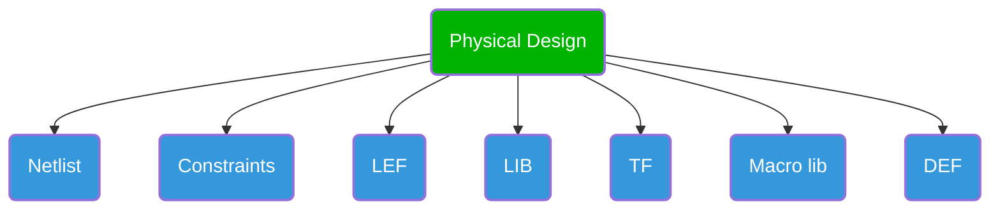

{/*- Inputs 
    - Netlist
    - Contraints
    - LEF
    - LIB
    - TF
    - Macro lib
    - DEF*/}

- Netlist
    - Contains ports, functionality, nets, and modules
- Constraints
    - Clock-related information
    - Design rule violation, transition, and capacitance specifications
- LEF (Library Exchange Format)
    - Contains physical overview
    - Cell names, sizes, and shapes of cells and macros
- LIB (Library)
    - Timing view
    - Delays at input and output pins of standard cells
    - Capacitance and transition characteristics
- TF (Technology File)
    - Technology file containing:
        - Resistance and capacitance of each metal layer
        - Spacing rules and colors of each metal layer
    - Interconnect file:
        - Parasitic information of metal layers to generate SPEF
        - Mapping file to map with technology file
- Macro Library
    - Contains macro cell definitions and specifications
- DEF (Design Exchange Format)
    - Physical partition information
    - Port details
    - Complete design specifications
