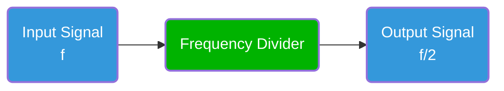

***made it work with installing wavedrom-cli and running `npm install -g wavedrom-cli ; wavedrom-cli -i wave_1.json -s wave_1.svg`***

```bash


```wavedrom
{signal: [
  {name: 'clk_in', wave: '.P...',period: 1 , node: ' abcd'},
  {name: 'clk_out', wave: ' P...',period: 2 , node: ' efgh'},
],
   edge: [
    'a~e', 'b~f', 'c~g', 'd~h',
    'e~>f', 'f->g', 'g-~>h', 'h~>i some text', 'h~->j'
  ]
}
```
/**/
